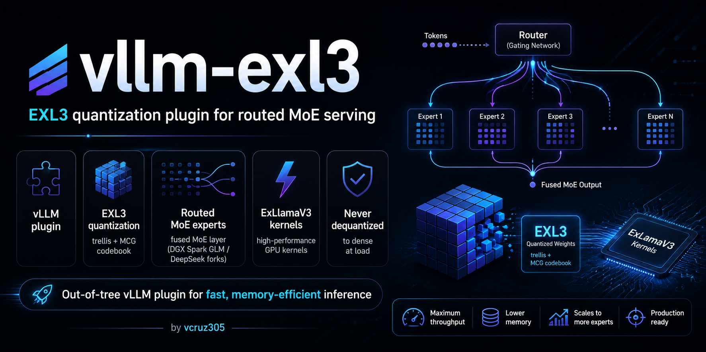

# vllm-exl3

[](https://x.com/ViC305) [](https://huggingface.co/vcruz305)

> ### Built on the work of others
>
> The EXL3 trellis format, the MCG codebook and the quantization method are [ExLlamaV3](https://github.com/turboderp-org/exllamav3) by Turboderp ([@turboderp](https://github.com/turboderp)). This plugin
> exists to serve their format.
>
> Substantial portions of `src/vllm_exl3/exl3.py` are **derived from** [Mia's AI Lab](https://github.com/MiaAI-Lab/GLM-5.3-Flash-EXL3-2x-DGX-Sparks) ([@MiaAI-Lab](https://github.com/MiaAI-Lab), [@plotarmordev](https://github.com/plotarmordev)) `overlay/exl3.py`, which they published first.
>
> Both projects are MIT licensed. Their notices are in [THIRD_PARTY_NOTICES.md](THIRD_PARTY_NOTICES.md)
> and must be kept with the code. Earlier releases here shipped without those notices, which was our
> mistake. Thank you to both projects for the work this is built on.

An out-of-tree vLLM plugin that registers `--quantization exl3`, serving
EXL3 (ExLlamaV3 trellis, MCG codebook) quantized packs — routed MoE experts
run packed through `exllamav3_ext` kernels, never dequantized to a dense
format at load.

If you use this plugin, please credit **vcruz305**.

## Scope (read this first)

Upstream vLLM has not accepted EXL3 support
([vllm-project/vllm#19896](https://github.com/vllm-project/vllm/issues/19896)).
This plugin works on stock vLLM only for architectures that already expose the
needed fused-MoE layer, such as the serving-proven DeepSeek-V4 path. Models
using the `RoutedExperts` family, including GLM-5.3, require a compatible vLLM
fork. Every deployment also requires
[exllamav3](https://github.com/turboderp-org/exllamav3) with its compiled
`exllamav3_ext` kernels for your GPU arch.

## Runtime

All EXL3 compute is delegated to `exllamav3_ext`. Routed MoE uses its fused
`exl3_moe` kernel when geometry permits; fat experts use its reconstruction and
`hgemm` path. Dense linears, MTP, `lm_head`, and n-gram embedding tables use
the same runtime. The native CUDA extension described in prior release notes
is not built or dispatched by this branch.

## Retired v0.3.1 Native Kernel Notes

Version `0.3.1` adds accelerated $128 \times 128$ tiled prefill CUDA kernels and verifies massive context scaling on NVIDIA DGX Spark GB10 (sm_121 Blackwell) with 128 GiB Unified Memory:

* **Super Fat Prefill GEMM (`csrc/exl3_fat_gemm.cu`)**: A $128 \times 128$ tiled CUDA GEMM for routed experts that receive large token batches during prefill, unrolling Trellis dequantization in registers and fusing Hadamard scaling directly into the tile.
* **Inline Routing & Atomic Token Scatter (`exl3_fat_gemm_scatter`)**: Fuses expert down-projection with routing weight multiplication and atomic token output scatter, running **up to 2.09x faster** than the reconstructed GEMM path ($400.4\ \mu\text{s} \to 195.3\ \mu\text{s}$ at $M=1024$) with **1.000000 cosine similarity parity**.
* **Max KV Cache Pool**: **1,908,408 tokens (~1.91 Million tokens)** allocated in 22.39 GiB FP8 memory on NVIDIA DGX Spark GB10 (sm_121 Blackwell) with 128 GiB Unified Memory.
* **Max Context Scaling**: Full **131,072 tokens (128K context)** supported with **14.56x concurrent streams**, and **262,144 tokens (256K context)** verified on DeepSeek-V4-Flash-Vision with DSpark speculative decoding.

### Prefill Down-Projection + Scatter Speedup (NVIDIA DGX Spark GB10 (sm_121 Blackwell) with 128 GiB Unified Memory)

| Prefill Rows ($M$) | Stock Reconstruct + GEMM | Native Fat Scatter | Net Speedup | Parity Cosine Similarity |
|---|---|---|:---:|:---:|
| **$M = 256$** | 144.3 $\mu\text{s}$ | **86.9 $\mu\text{s}$** | **1.66x** | 1.000000 |
| **$M = 512$** | 222.8 $\mu\text{s}$ | **106.4 $\mu\text{s}$** | **2.09x** | 1.000000 |
| **$M = 1024$** | 400.4 $\mu\text{s}$ | **195.3 $\mu\text{s}$** | **2.05x** | 1.000000 |
| **$M = 2048$** | 733.1 $\mu\text{s}$ | **508.7 $\mu\text{s}$** | **1.44x** | 1.000000 |

### Speculation and Context Scaling Helpers

The plugin exposes small serving-side helpers so a scheduler and its
admission checks share one policy:

* **Dynamic speculative draft scheduler** —
  `get_speculative_draft_tokens(batch_size)` selects `K=3` for batches `[1..4]`,
  `K=2` for `[5..8]`, `K=1` for `[9..16]`, and `K=0` otherwise. Override the
  ranges with `VLLM_EXL3_SPEC_SCHEDULE=1:4:3,5:8:2,9:16:1` or a caller-supplied
  schedule.
* **Vectorized on-device confidence pruning** —
  `filter_speculative_candidates(probs, threshold=0.5)` keeps only the
  sequential confident prefix for each sequence and returns a boolean mask
  plus per-sequence kept counts. Enable the integration with
  `VLLM_EXL3_ADAPTIVE_VERIFICATION=1` (also accepts `true`, `yes`, or `on`).
* **MLA KV-cache headroom** — `compute_mla_kv_cache_bytes` and
  `validate_context_scaling` model compressed KV storage before a launch. At
  the default 43 layers and FP8 storage, 64K requires **1.51 GiB**, 128K
  requires **3.02 GiB**, and 256K requires **6.05 GiB**. The validator reports
  usable headroom and physical safety margin for NVIDIA DGX Spark GB10
  (sm_121 Blackwell) with 128 GiB Unified Memory.

## Retired v0.3.0 Native Kernel Notes

Version `0.3.0` introduced custom native CUDA kernels (`csrc/`) replacing the stock `exllamav3_ext` decode and prefill paths on NVIDIA DGX Spark GB10 (sm_121 Blackwell) with 128 GiB Unified Memory:

* **In-Register Trellis Dequantization (`csrc/exl3_dequant.cuh`)**: Unrolls MCG bit extraction into registers without intermediate global memory roundtrips.
* **Dense & Batched GEMV (`csrc/exl3_gemv.cu`, `csrc/p2b_batched.cu`)**: Active-expert batched GEMV saturating 99.2% of the physical memory bandwidth floor (73.3 $\mu\text{s}$).
* **4-Phase Cooperative MoE Decode (`csrc/p2b_moe.cu`)**: End-to-end fused MoE decode reducing per-layer latency from $497\ \mu\text{s} \to 287.8\ \mu\text{s}$ ($1.73\times$).
* **Power-of-Two Chunked Prefill GEMM (`csrc/exl3_gemm.cu`)**: Tiled matrix multiplication delivering 7.85 TFLOPS ($13.0\times$ faster than legacy prefill).
* **vLLM Dispatch Control**: `VLLM_EXL3_MOE_KERNEL=auto` (default) selects an available backend; `native` and `exllamav3` request a specific backend. Unsupported native cases fall back to ExLlamaV3 or the Python loop.

The unreleased native MoE ABI 2 adds local expert widths of 1024 and 2048 at
hidden width 4096, with optional SwiGLU input clipping. This covers ordinary TP2
and TP1 expert geometry while retaining K2/K3/K4 and model-provided routing.
The wrapper still supports 1–8 decode rows through one native call per row.
Rebuild the extension with `pip install -e . --no-build-isolation`; the loaded
`vllm_exl3_c.P2B_MOE_ABI_VERSION` should be `2`. Older binaries fall back for
clipped or 1024-wide requests instead of interpreting incompatible pointers.
No speculative-depth default changes are included. Run
`python -m pytest -q tests/test_native_moe_contract.py` on the CUDA host before
qualifying the new path; its GPU checks cover independent CPU weight
reconstruction, clipping, and graph replay. Full-model correctness and speed
still need validation on the intended TP1/TP2 deployment.

### Live Head-to-Head Benchmark Receipts

Measured simultaneously across two physical NVIDIA DGX Spark GB10 (sm_121 Blackwell) with 128 GiB Unified Memory nodes (Baseline ExLlamaV3 vs. Native EXL3) running `GLM-5.3-Flash-EXL3-K2` via live vLLM HTTP streaming API:

| Category | Baseline ExLlamaV3 | Native EXL3 | Baseline TTFT | Native TTFT | Net Speedup |
|---|---|---|---|---|:---:|
| **Coding** | 14.9 tok/s | **27.6 tok/s** | 2,343.8 ms | **859.1 ms** | **+85.6%** |
| **Prose** | 13.7 tok/s | **24.6 tok/s** | 355.4 ms | **308.7 ms** | **+79.3%** |
| **Reasoning** | 18.9 tok/s | **25.1 tok/s** | 482.2 ms | **407.8 ms** | **+32.7%** |
| **Summary** | 17.1 tok/s | **25.6 tok/s** | 409.6 ms | **345.4 ms** | **+50.0%** |
| **Format** | 16.3 tok/s | **24.0 tok/s** | 401.9 ms | **349.8 ms** | **+47.7%** |
| **JSON** | 20.8 tok/s | **25.6 tok/s** | 502.6 ms | **414.1 ms** | **+23.3%** |
| **HTML** | 19.5 tok/s | **23.1 tok/s** | 361.7 ms | **323.1 ms** | **+18.6%** |
| **Narrative** | 14.0 tok/s | **21.0 tok/s** | 395.4 ms | **333.0 ms** | **+50.0%** |
| **Average Across Categories** | **16.9 tok/s** | **24.6 tok/s** | **656.6 ms** | **417.6 ms** | **+45.6%** |

### Per-Step Decode Latency Breakdown (C1)

* **40 MoE Layers**: Cut from $19.9\ \text{ms} \to 11.5\ \text{ms}$ ($497\ \mu\text{s} \to 287.8\ \mu\text{s}$ per layer), saving **8.4 ms in MoE compute alone** per token.
* **Total Per-Step Time**: Reduced from **$59.2\ \text{ms} \to 40.6\ \text{ms}$ (-31.4%)**, directly powering the +45.6% throughput gain.
* **Prefill GEMM**: 7.85 TFLOPS ($13.0\times$ faster), holding **1,875 tok/s** cold prefill across 65k context.
* **NVMe Storage Scaling**: 8-worker parallel read reaches **3,563 MB/s** ($3.0\times$ speedup over single-thread 1,185 MB/s), loading 96 GB weights in ~27 seconds.

### Essential Serving Flag
When running on NVIDIA DGX Spark GB10 (sm_121 Blackwell) with 128 GiB Unified Memory or other long-context instances, pass:
```bash
--long-prefill-token-threshold 1024
```
This prevents long prompt prefill from starving parallel decode steps and stalling the scheduler.

## Supported architectures

| Architecture | Status | Reference pack |
|---|---|---|
| `Glm5Next` (GLM-5.3-Flash) | serving-proven | GLM-5.3-Flash EXL3 K2 / K2K3-mix |
| `DeepseekV4` (DeepSeek-V4-Flash) | serving-proven on stock vLLM 0.28.0 (text, DSpark draft) and on the vLLM nightly vision class (text + images + DSpark draft, 64k context, tool calling); three small serving-side patches live in the recipe | DSV4-Flash-Vision EXL3 MixedK |
| `Qwen4ExpForConditionalGeneration` (Qwen3.8-Flash-Next) | serving-proven, native ExLlamaV3 pack (fractional-bit mul1 experts, padded dense linears, row-wise n-gram embedding table); three small vLLM patches in `tools/patch_vllm_qwen4_exp/` | [turboderp/Qwen3.8-Flash-Next-exl3](https://huggingface.co/turboderp/Qwen3.8-Flash-Next-exl3), revision `3.05bpw_h5_ng5` |

### Native ExLlamaV3 packs

Beyond packs produced by this project's own conversion path, the plugin also
serves packs quantized directly by turboderp's ExLlamaV3 tooling ("native"
packs), which can assign a fractional average bit width (e.g. 3.05 bpw) by
choosing bits per tensor rather than one width for the whole model. Support
for this covers:

- the `mul1` codebook (alongside `mcg`), selected per tensor via the packed
  marker rather than declared once for the whole model;
- per-tensor K for dense linears and `lm_head` through `non_routed_exl3`;
- matrices padded to a multiple of 128 so trellis tiles never spill past
  the real dimension;
- row-wise n-gram embedding tables (`ngram_embedding`) kept packed instead
  of expanded to BF16 -- 30.4 GiB on device instead of 102 GB.

A native pack's `config.json` was not written for this plugin, so
`tools/exl3_pack_tools/` rewrites it (see that directory's README), and
`model.safetensors.index.json` must list every `*.safetensors` file the pack
actually ships or vLLM silently skips tensors --
`tools/exl3_pack_tools/regenerate_safetensors_index.py` rebuilds it from the
files on disk. `Qwen4ExpForConditionalGeneration` also needs the three vLLM
patches in `tools/patch_vllm_qwen4_exp/` so vLLM's own model code passes
`quant_config` through to `lm_head` and the n-gram table at all.

**Preliminary numbers** (2026-09-07, one DGX Spark GB10, 128 GB, 32768
context, `--gpu-memory-utilization 0.80`, one request, decode excluding
TTFT):

| Mode | Decode | TTFT (128 tok) | Mean acceptance | Ready | On device | KV cache |
|---|---|---|---|---|---|---|
| No draft | 27.2-28.0 tok/s | 0.185 s | -- | ~13 min | 78.6 GiB | 385,570 tokens |
| MTP k=1 | 33.8-36.4 tok/s | 0.199 s | 1.86 of 2 | ~13 min | 78.6 GiB | 275,636 tokens |
| MTP k=2 | 37.3-41.3 tok/s | 0.201 s | 2.54 of 3 | ~12 min | 78.6 GiB | 235,412 tokens |
| MTP k=3 | 34.4-38.2 tok/s | 0.21 s | 2.95 of 4 | ~11 min | 78.6 GiB | 224,694 tokens |

Long context (same pack, no draft): at `--max-model-len 262144` the KV cache is 546,503 tokens
(util 0.80, 2 sequences, about 19 GiB free) or 759,773 tokens (util 0.85, 4 sequences, 11.5 GiB
free); a 122,902-token prompt prefills in about 107 s and decode stays at 26-27 tok/s. With MTP
k=2 at 262k the KV cache is 402,630 tokens and long-prompt decode is about 43 tok/s. 262144 is the
model's `max_position_embeddings`.

Recipe: https://github.com/vcruz305/Qwen3.8-Flash-Next-EXL3-DGX-Spark-recipe

### Long-prompt quality check

Short prompts route few rows per expert and never reach the fat-expert prefill path, so a pack can generate fluent text while its long-prompt output is wrong. Before this fix, packs whose gate and up experts carry distinct `suh` rotations (turboderp's native Qwen3.8-Flash-Next pack, for example) scored mean NLL 4.21 over a 6000-token prompt through vLLM against 0.94 through exllamav3 on the same weights; every release up to 0.3.x is affected. After changing anything on the expert path, score a few-thousand-token text with `prompt_logprobs` through vLLM and through exllamav3 on the same token ids and compare per-token NLL; a mean difference above about 0.05 nats is a bug. Setting `VLLM_EXL3_FAT_THRESHOLD=1000000000` disables the fat path as a workaround on older builds.

### Fixed: engine wedge on the vLLM nightly V2 runner

On vLLM 0.28.1rc1 nightly with the V2 model runner and Qwen3.8-Flash-Next, prompts of roughly 33 to 144 tokens wedged the engine (EngineCore at 100% CPU, GPU busy at idle power, never recovering), and MTP k=2 evaluation runs hit the same wedge on their 100 to 150-token prompts after 30 to 60 minutes. exllamav3 dispatches dense calls by row count: up to 2 rows run the non-cooperative GEMV, 3 to 144 rows run the cooperative trellis GEMM (grid barriers over a shared lock buffer), and above 144 rows it reconstructs the weight and runs hgemm. The cooperative GEMM is the kernel that wedges. The plugin now sends dense calls with 17 to 144 rows through the reconstruct path (exact) and leaves rows up to 16 on exllamav3's dispatch. A 4-worker MTP k=2 stress that wedged the previous build in 161 s ran clean for 45 minutes (1085 requests, 77 tok/s aggregate) with decode speed unchanged; the 32-token prompt TTFT is about 0.25 s. `VLLM_EXL3_RECONSTRUCT_MIN_ROWS` moves the threshold, `VLLM_EXL3_COOP_GEMM=1` restores the old dispatch for A/B runs, and `VLLM_EXL3_PREFILL_SYNC` is no longer needed.

## Config contract

The pack's `config.json` must declare the quantization; without it, vLLM
silently resolves whatever the base model's config claims and the load is
wrong by construction:

```json
"quantization_config": {
  "quant_method": "exl3",
  "bits": 2,
  "codebook": "mcg",
  "layer_bits": {"3": 3, "13": 3},
  "non_routed_quantization": {"quant_method": "fp8", "fmt": "e4m3", "weight_block_size": [128, 128]}
}
```

- `bits` — default bits-per-weight for routed experts.
- `layer_bits` *(optional)* — per-layer override map for mixed-bitrate
  (MixedK) packs; keys are layer indices as strings.
- `non_routed_quantization` *(optional)* — for packs whose non-routed
  weights stay in the official source format (e.g. DeepSeek block-FP8),
  the declared quant method handles those layers; the exl3 method composes
  with it instead of forcing them unquantized. Omit for packs whose
  non-routed weights are native BF16 (e.g. GLM-5.3-Flash). Declaring fp8
  for BF16 tensors is not caught by vLLM: the layer boots with an
  uninitialized `weight_scale_inv` and the model emits empty text.
- `non_routed_dtype_policy: "bf16_as_stored"` *(optional)* — the dense
  linears are plain BF16 and are never delegated, while
  `non_routed_quantization` still serves source-format draft (MTP) experts
  declared via `mtp_experts: "source"` + `mtp_experts_start_layer`. This is
  the combination DeepSeek-V4-Flash packs need for speculative decoding.
- `non_routed_exl3` *(optional)* — serves EXL3 tensors for the dense
  (non-expert) linears too. Two forms, the explicit one wins:

  ```json
  "non_routed_exl3": {
    "codebook": "mul1",
    "layers": {
      "language_model.model.layers.0.self_attn.o_proj": {"bits": 4},
      "language_model.model.layers.0.self_attn.in_proj_qkvbfg_a": {"bits": 4, "bf16_shards": [3, 4, 5]},
      "language_model.model.layers.0.mlp.gate_up_proj": {"bits": 3}
    }
  }
  ```

  `layers` keys are the module prefixes vLLM builds (after its weight-name
  mapper, so for GLM-5.3-Flash the root is `language_model.model.`), not the
  safetensors names. Fused modules take one entry; every EXL3 shard in a
  fused module must share `bits`. `bf16_shards` lists the shards of a fused
  module that stay BF16 and load from their `.weight` tensor (tensor
  parallel size 1 only). The short form `{"modules": [...suffixes],
  "bits": K, "layer_bits": {...}}` matches by module suffix. Each EXL3 shard
  loads `.trellis/.suh/.svh` plus one `.mcg` or `.mul1` marker; a stale
  BF16 `.weight` for an EXL3 shard is shape-checked and discarded, so a pack
  may overlay EXL3 tensors on top of shards that still carry the BF16 copy.
  `lm_head` is covered too: give it its own entry under
  `non_routed_exl3.layers` (or match it via the short form's `modules`) once
  the model passes `quant_config=` through to its `ParallelLMHead`. Not every
  model does this by default -- `Qwen4ExpForConditionalGeneration` needs the
  vLLM patches in `tools/patch_vllm_qwen4_exp/` first.
- `ngram_embedding` *(optional)* -- a row-wise n-gram embedding table kept in
  its packed ExLlamaV3 format instead of expanded to BF16 (e.g. the PLE table
  in `Qwen4ExpForConditionalGeneration`):

  ```json
  "ngram_embedding": {
    "bits": 5,
    "num_shards": 128,
    "rows_per_shard": 2500012,
    "num_heads": 16,
    "modules": ["ngram_embedding"]
  }
  ```

  `modules` matches by prefix suffix, same as `non_routed_exl3`'s short form.
  The checkpoint stores, per shard, `shard_<i>.trellis` (int16,
  `[rows_per_shard, 1 + 160*bits/16]`), plus one `head_bias` (fp16,
  `[num_heads, 160]`), `head_offsets` and `head_vocab_sizes` (int64,
  `[num_heads]`), and `layer_multipliers` (int64). Tensor parallel size 1
  only. The dequant kernel is chosen with `VLLM_EXL3_NGRAM_KERNEL=ext`
  (default, the compiled `exllamav3_ext` kernel) or `=torch` (a pure-PyTorch
  fallback, used by the CPU-only unit tests and as a correctness cross-check).

## Install

`main` now carries unreleased `0.4.0`, with native ExLlamaV3 pack support
(mul1 codebooks, padded dense geometry, row-wise n-gram embedding tables).
Until it's tagged, install straight from `main` to get it:

```bash
pip install git+https://github.com/vcruz305/vllm-exl3@main
```

Install the compatible vLLM fork separately; the plugin deliberately does not
depend on the upstream `vllm` PyPI distribution. The wheel requires
`exllamav3>=1.4`, which provides the architecture-specific `exllamav3_ext`
extension. Verify that the extension built for the target GPU is available
before starting vLLM:

```bash
python -c "import exllamav3_ext"
```

Prebuilt wheels ship alongside the runtime wheels on Hugging Face for fast
one-shot installs — see
[vcruz305/GLM-5.3-Flash-EXL3-K2-spark-vllm](https://huggingface.co/vcruz305/GLM-5.3-Flash-EXL3-K2-spark-vllm)
and the recipe repos below. `v0.3.1` is the last tagged release:

```bash
pip install https://github.com/vcruz305/vllm-exl3/releases/download/v0.3.1/vllm_exl3-0.3.1-cp312-cp312-linux_aarch64.whl
```

The `v0.3.1` tag's `exl3.py` does not import (a module docstring sits above
`from __future__ import annotations`); use the `v0.3.0` tag or `main` instead.

Check the [releases page](https://github.com/vcruz305/vllm-exl3/releases) for
the current platform tag; wheels are built per Python/arch combination.

The old `glm53_exl3_plugin` import path still works via a deprecated shim
and will be removed in a future release.

## Recipes

- [GLM-5.3-Flash EXL3 K2 on NVIDIA DGX Spark GB10 (sm_121 Blackwell) with 128 GiB Unified Memory](https://github.com/vcruz305/GLM-5.3-Flash-EXL3-K2-DGX-Spark-recipe): serving-proven on one or two Sparks.
- [GLM-5.3-Flash EXL3 K2/K3 mix on NVIDIA DGX Spark GB10 (sm_121 Blackwell) with 128 GiB Unified Memory](https://github.com/vcruz305/GLM-5.3-Flash-EXL3-K2K3-mix-DGX-Spark-recipe)
- [DeepSeek-V4-Flash-Vision EXL3 MixedK on NVIDIA DGX Spark GB10 (sm_121 Blackwell) with 128 GiB Unified Memory](https://github.com/vcruz305/DeepSeek-V4-Flash-Vision-EXL3-MixedK-DGX-Spark-recipe): mixed-bit routed experts, DSpark speculative decoding, one Spark.
- [Qwen3.8-Flash-Next EXL3 on NVIDIA DGX Spark GB10 (sm_121 Blackwell) with 128 GiB Unified Memory](https://github.com/vcruz305/Qwen3.8-Flash-Next-EXL3-DGX-Spark-recipe): native pack, 3.05bpw, one Spark with MTP k=2. Greedy decode 47.6 tok/s p50 and 0.300 s TTFT p50, 38.4 tok/s at vendor thinking settings, 1,122 tok/s prefill on a 9.5k-token prompt, sixcat 87.5. The whole model including the n-gram embedding table stays resident in 102 GiB, leaving room for 304k tokens of KV cache; the Q4_K_M GGUF of the same model pages a 95.4 GiB embedding table from disk and runs 1.45x slower to decode and about half as fast to prefill.

## Credits and upstream work

This project stands on other people's work, and two projects in particular.

**[ExLlamaV3](https://github.com/turboderp-org/exllamav3) by Turboderp ([@turboderp](https://github.com/turboderp)).** The EXL3 trellis format, the
MCG codebook, quantization method, and runtime kernels are theirs. MIT, Copyright (c) 2025 Turboderp.

**[GLM-5.3-Flash-EXL3-2x-DGX-Sparks](https://github.com/MiaAI-Lab/GLM-5.3-Flash-EXL3-2x-DGX-Sparks)
by Mia's AI Lab ([@MiaAI-Lab](https://github.com/MiaAI-Lab)), fat-expert batching by [@plotarmordev](https://github.com/plotarmordev).** Substantial portions of
`src/vllm_exl3/exl3.py` derive from their `overlay/exl3.py`, which they published first. MIT,
Copyright (c) 2026 Mia's AI Lab.

Both licences require their notices to travel with the code. Those notices are in
[THIRD_PARTY_NOTICES.md](THIRD_PARTY_NOTICES.md) and must be retained on redistribution. Earlier
releases of this repository carried this code without those notices; that was an oversight on our
part and this section, the third-party notices file and the per-file headers correct it.


## License

Apache-2.0. Redistribution must retain the [NOTICE](NOTICE) file — see
`LICENSE` §4(d).

## EXL3 packs and recipes

### Packs (Hugging Face)

| Model | Description |
|---|---|
| [GLM-5.3-Flash-EXL3-K2](https://huggingface.co/vcruz305/GLM-5.3-Flash-EXL3-K2) | GLM-5.3-Flash, 2-bit routed experts |
| [GLM-5.3-Flash-Uncensored-EXL3-K2](https://huggingface.co/vcruz305/GLM-5.3-Flash-Uncensored-EXL3-K2) | GLM-5.3-Flash Uncensored, 2-bit routed experts |
| [GLM-5.3-Flash-EXL3](https://huggingface.co/vcruz305/GLM-5.3-Flash-EXL3) | GLM-5.3-Flash, 3-bit routed experts |
| [GLM-5.3-Flash-EXL3-K2K3-mix](https://huggingface.co/vcruz305/GLM-5.3-Flash-EXL3-K2K3-mix) | GLM-5.3-Flash, mixed 2/3-bit routed experts |
| [DSV4-Flash-Vision-EXL3-MixedK](https://huggingface.co/vcruz305/DSV4-Flash-Vision-EXL3-MixedK) | DeepSeek-V4-Flash Vision, mixed-bit routed experts |
| [DSV4-Flash-Vision-ablit-EXL3-MixedK](https://huggingface.co/vcruz305/DSV4-Flash-Vision-ablit-EXL3-MixedK) | DeepSeek-V4-Flash Vision Uncensored, mixed-bit routed experts |

### Serving recipes (GitHub)

| Recipe | Description |
|---|---|
| [GLM-5.3-Flash-EXL3-K2-DGX-Spark-recipe](https://github.com/vcruz305/GLM-5.3-Flash-EXL3-K2-DGX-Spark-recipe) | GLM-5.3-Flash EXL3 K2 on NVIDIA DGX Spark GB10 (sm_121 Blackwell) with 128 GiB Unified Memory |
| [GLM-5.3-Flash-EXL3-K2K3-mix-DGX-Spark-recipe](https://github.com/vcruz305/GLM-5.3-Flash-EXL3-K2K3-mix-DGX-Spark-recipe) | GLM-5.3-Flash EXL3 K2/K3 mix on NVIDIA DGX Spark GB10 (sm_121 Blackwell) with 128 GiB Unified Memory |
| [DeepSeek-V4-Flash-Vision-EXL3-MixedK-DGX-Spark-recipe](https://github.com/vcruz305/DeepSeek-V4-Flash-Vision-EXL3-MixedK-DGX-Spark-recipe) | DeepSeek-V4-Flash Vision EXL3 MixedK on NVIDIA DGX Spark GB10 (sm_121 Blackwell) with 128 GiB Unified Memory: stock 0.28.0 and nightly vision routes, DSpark speculative decoding, tool calling, remote vision test guide |
| [GLM-5.3-Flash-EXL3-K2-spark-vllm](https://huggingface.co/vcruz305/GLM-5.3-Flash-EXL3-K2-spark-vllm) | Prebuilt vLLM runtime wheels |


## Roadmap

- **Stock vLLM (DeepSeek-V4): done in 0.2.3.** The `bf16_as_stored` policy plus
  the recipe's three loader patches serve the DSV4 packs on stock 0.28.0 and on
  the nightly vision class. Upstreaming those patches and the `FusedMoE` compat
  layer for other architectures is next; GLM-5.3 remains fork-only until the
  architecture exists upstream.
- **Dense EXL3 for `lm_head` (`ParallelLMHead`): done in this release**, via
  `non_routed_exl3` (plus the vLLM plumbing patches for
  `Qwen4ExpForConditionalGeneration`). Padded dense geometry and n-gram
  embedding tables are tensor-parallel-1 only; TP>1 with `bf16_shards`
  remains open.
- Fat-expert prefill acceleration (sorted/batched expert dispatch) for extreme
  contexts.
